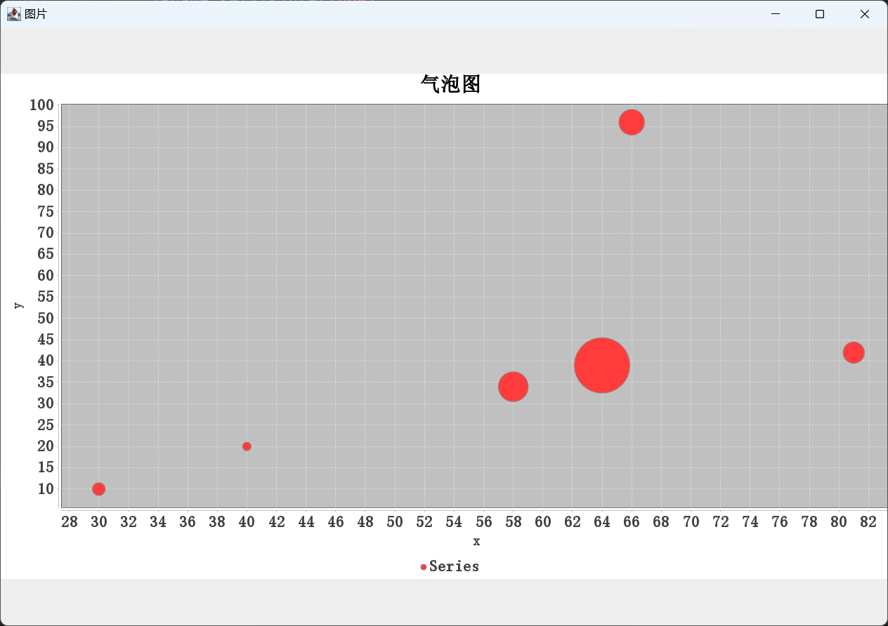
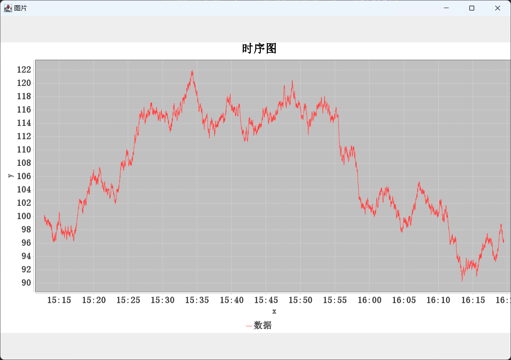
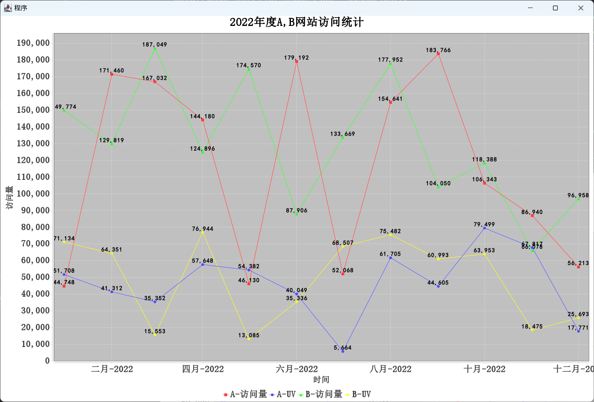

# JFreechart

## 概述

JFreeChart是JAVA平台上的一个开放的图表绘制类库。它完全使用JAVA语言编写，可生成饼图（pie charts）、柱状图（bar charts）、散点图（scatter plots）、时序图（time series）、甘特图（Gantt charts）等等多种图表，并且可以产生PNG和JPEG格式的输出，还可以与PDF或EXCEL关联。


## 依赖

```xml
<dependency>
    <groupId>org.jfree</groupId>
    <artifactId>jfreechart</artifactId>
    <version>1.5.0</version>
</dependency>
```


## 饼图和3D饼图

```java
package mao;

import org.jfree.chart.ChartFactory;
import org.jfree.chart.ChartUtils;
import org.jfree.chart.JFreeChart;
import org.jfree.chart.StandardChartTheme;
import org.jfree.data.general.DefaultPieDataset;

import javax.imageio.ImageIO;
import javax.swing.*;
import java.awt.*;
import java.awt.event.WindowAdapter;
import java.awt.event.WindowEvent;
import java.awt.image.BufferedImage;
import java.io.File;
import java.io.FileInputStream;
import java.io.IOException;

/**
 * Project name(项目名称)：数据可视化_JFreechart的使用
 * Package(包名): mao
 * Class(类名): Test1
 * Author(作者）: mao
 * Author QQ：1296193245
 * GitHub：https://github.com/maomao124/
 * Date(创建日期)： 2023/6/8
 * Time(创建时间)： 22:22
 * Version(版本): 1.0
 * Description(描述)： 无
 */

public class Test1
{
    public static void main(String[] args) throws IOException
    {
        //构建饼图的数据集
        DefaultPieDataset<String> dataset = new DefaultPieDataset<String>();

        dataset.setValue("第一中学", 4572);
        dataset.setValue("第二中学", 2177);
        dataset.setValue("第四中学", 958);
        dataset.setValue("第五中学", 5433);
        dataset.setValue("第七中学", 3498);


        StandardChartTheme standardChartTheme = new StandardChartTheme("CN");
        //设置标题字体
        standardChartTheme.setExtraLargeFont(new Font("宋体", Font.BOLD, 28));
        //设置图例的字体
        standardChartTheme.setRegularFont(new Font("宋体", Font.BOLD, 22));
        //设置轴向的字体
        standardChartTheme.setLargeFont(new Font("宋体", Font.BOLD, 20));
        //应用主题样式
        ChartFactory.setChartTheme(standardChartTheme);
        //参数1 title 标题
        //参数2　dataset 数据集
        //参数3  是否开启图例
        //参数4  是否开启工具栏
        //参数5  是否开启url跳转
        JFreeChart chart = ChartFactory.createPieChart("xx县各学校学生人数", dataset, true, false, false);
        //生成一张图表的图片文件

        String path = "./chart1.png";

        ChartUtils.saveChartAsPNG(new File(path), chart, 1280, 720);

        BufferedImage bufferedImage = ImageIO.read(new FileInputStream(path));
        JLabel jLabel = new JLabel();
        jLabel.setIcon(new ImageIcon(bufferedImage));

        JFrame jFrame = new JFrame("图片");                                   //初始化顶层面板
        jFrame.setSize(1280, 900);
        int screenWidth = Toolkit.getDefaultToolkit().getScreenSize().width;       //获取屏幕宽度
        int screenHeight = Toolkit.getDefaultToolkit().getScreenSize().height;     //获取屏幕高度
        jFrame.setLocation(screenWidth / 2 - jFrame.getWidth() / 2, screenHeight / 2 - jFrame.getHeight() / 2);  //位于屏幕中央

        jFrame.add(jLabel);
        jFrame.setVisible(true);
        jFrame.addWindowListener(new WindowAdapter()
        {
            @Override
            public void windowClosing(WindowEvent e)
            {
                System.exit(1);
            }
        });
    }
}
```


```java
package mao;

import org.jfree.chart.ChartFactory;
import org.jfree.chart.ChartUtils;
import org.jfree.chart.JFreeChart;
import org.jfree.chart.StandardChartTheme;
import org.jfree.data.general.DefaultPieDataset;

import javax.imageio.ImageIO;
import javax.swing.*;
import java.awt.*;
import java.awt.event.WindowAdapter;
import java.awt.event.WindowEvent;
import java.awt.image.BufferedImage;
import java.io.File;
import java.io.FileInputStream;
import java.io.IOException;

/**
 * Project name(项目名称)：数据可视化_JFreechart的使用
 * Package(包名): mao
 * Class(类名): Test2
 * Author(作者）: mao
 * Author QQ：1296193245
 * GitHub：https://github.com/maomao124/
 * Date(创建日期)： 2023/6/9
 * Time(创建时间)： 20:56
 * Version(版本): 1.0
 * Description(描述)： 无
 */

public class Test2
{
    public static void main(String[] args) throws IOException
    {
        //构建饼图的数据集
        DefaultPieDataset<String> dataset = new DefaultPieDataset<String>();

        dataset.setValue("第一中学", 4572);
        dataset.setValue("第二中学", 2177);
        dataset.setValue("第四中学", 958);
        dataset.setValue("第五中学", 5433);
        dataset.setValue("第七中学", 3498);


        StandardChartTheme standardChartTheme = new StandardChartTheme("CN");
        //设置标题字体
        standardChartTheme.setExtraLargeFont(new Font("宋体", Font.BOLD, 28));
        //设置图例的字体
        standardChartTheme.setRegularFont(new Font("宋体", Font.BOLD, 22));
        //设置轴向的字体
        standardChartTheme.setLargeFont(new Font("宋体", Font.BOLD, 20));
        //应用主题样式
        ChartFactory.setChartTheme(standardChartTheme);
        //参数1 title 标题
        //参数2　dataset 数据集
        //参数3  是否开启图例
        //参数4  是否开启工具栏
        //参数5  是否开启url跳转
        JFreeChart chart = ChartFactory.createPieChart3D("xx县各学校学生人数", dataset, true, false, false);
        //生成一张图表的图片文件

        String path = "./chart2.png";

        ChartUtils.saveChartAsPNG(new File(path), chart, 1280, 720);

        BufferedImage bufferedImage = ImageIO.read(new FileInputStream(path));
        JLabel jLabel = new JLabel();
        jLabel.setIcon(new ImageIcon(bufferedImage));

        JFrame jFrame = new JFrame("图片");                                   //初始化顶层面板
        jFrame.setSize(1280, 900);
        int screenWidth = Toolkit.getDefaultToolkit().getScreenSize().width;       //获取屏幕宽度
        int screenHeight = Toolkit.getDefaultToolkit().getScreenSize().height;     //获取屏幕高度
        jFrame.setLocation(screenWidth / 2 - jFrame.getWidth() / 2, screenHeight / 2 - jFrame.getHeight() / 2);  //位于屏幕中央

        jFrame.add(jLabel);
        jFrame.setVisible(true);
        jFrame.addWindowListener(new WindowAdapter()
        {
            @Override
            public void windowClosing(WindowEvent e)
            {
                System.exit(1);
            }
        });
    }
}
```


```java
package mao;

import org.jfree.chart.ChartFactory;
import org.jfree.chart.ChartUtils;
import org.jfree.chart.JFreeChart;
import org.jfree.chart.StandardChartTheme;
import org.jfree.data.general.DefaultPieDataset;

import javax.imageio.ImageIO;
import javax.swing.*;
import java.awt.*;
import java.awt.event.WindowAdapter;
import java.awt.event.WindowEvent;
import java.awt.image.BufferedImage;
import java.io.File;
import java.io.FileInputStream;
import java.io.IOException;

/**
 * Project name(项目名称)：数据可视化_JFreechart的使用
 * Package(包名): mao
 * Class(类名): Test2
 * Author(作者）: mao
 * Author QQ：1296193245
 * GitHub：https://github.com/maomao124/
 * Date(创建日期)： 2023/6/9
 * Time(创建时间)： 20:56
 * Version(版本): 1.0
 * Description(描述)： 无
 */

public class Test2
{
    public static void main(String[] args) throws IOException
    {
        //构建饼图的数据集
        DefaultPieDataset<String> dataset = new DefaultPieDataset<String>();

        dataset.setValue("第一中学", 4572);
        dataset.setValue("第二中学", 2177);
        dataset.setValue("第四中学", 958);
        dataset.setValue("第五中学", 5433);
        dataset.setValue("第七中学", 3498);
        dataset.setValue("第八中学", 2177);
        dataset.setValue("第九中学", 374);
        dataset.setValue("第十中学", 3511);


        StandardChartTheme standardChartTheme = new StandardChartTheme("CN");
        //设置标题字体
        standardChartTheme.setExtraLargeFont(new Font("宋体", Font.BOLD, 28));
        //设置图例的字体
        standardChartTheme.setRegularFont(new Font("宋体", Font.BOLD, 22));
        //设置轴向的字体
        standardChartTheme.setLargeFont(new Font("宋体", Font.BOLD, 20));
        //应用主题样式
        ChartFactory.setChartTheme(standardChartTheme);
        //参数1 title 标题
        //参数2　dataset 数据集
        //参数3  是否开启图例
        //参数4  是否开启工具栏
        //参数5  是否开启url跳转
        JFreeChart chart = ChartFactory.createPieChart3D("xx县各学校学生人数", dataset, true, false, false);
        //生成一张图表的图片文件

        String path = "./chart2.png";

        ChartUtils.saveChartAsPNG(new File(path), chart, 1280, 720);

        BufferedImage bufferedImage = ImageIO.read(new FileInputStream(path));
        JLabel jLabel = new JLabel();
        jLabel.setIcon(new ImageIcon(bufferedImage));

        JFrame jFrame = new JFrame("图片");                                   //初始化顶层面板
        jFrame.setSize(1280, 900);
        int screenWidth = Toolkit.getDefaultToolkit().getScreenSize().width;       //获取屏幕宽度
        int screenHeight = Toolkit.getDefaultToolkit().getScreenSize().height;     //获取屏幕高度
        jFrame.setLocation(screenWidth / 2 - jFrame.getWidth() / 2, screenHeight / 2 - jFrame.getHeight() / 2);  //位于屏幕中央

        jFrame.add(jLabel);
        jFrame.setVisible(true);
        jFrame.addWindowListener(new WindowAdapter()
        {
            @Override
            public void windowClosing(WindowEvent e)
            {
                System.exit(1);
            }
        });
    }
}
```


## 折线图

```java
package mao;

import org.jfree.chart.ChartFactory;
import org.jfree.chart.ChartUtils;
import org.jfree.chart.JFreeChart;
import org.jfree.chart.StandardChartTheme;
import org.jfree.data.category.DefaultCategoryDataset;
import org.jfree.data.general.DefaultPieDataset;

import javax.imageio.ImageIO;
import javax.swing.*;
import java.awt.*;
import java.awt.event.WindowAdapter;
import java.awt.event.WindowEvent;
import java.awt.image.BufferedImage;
import java.io.File;
import java.io.FileInputStream;
import java.io.IOException;

/**
 * Project name(项目名称)：数据可视化_JFreechart的使用
 * Package(包名): mao
 * Class(类名): Test3
 * Author(作者）: mao
 * Author QQ：1296193245
 * GitHub：https://github.com/maomao124/
 * Date(创建日期)： 2023/6/9
 * Time(创建时间)： 21:05
 * Version(版本): 1.0
 * Description(描述)： 无
 */

public class Test3
{
    /**
     * 得到int随机
     *
     * @param min 最小值
     * @param max 最大值
     * @return int
     */
    public static int getIntRandom(int min, int max)
    {
        if (min > max)
        {
            min = max;
        }
        return min + (int) (Math.random() * (max - min + 1));
    }

    public static void main(String[] args) throws IOException
    {
        //构建饼图的数据集
        DefaultCategoryDataset dataset = new DefaultCategoryDataset();

        for (int i = 2012; i <= 2023; i++)
        {
            dataset.setValue(getIntRandom(200, 7000), "第一中学", String.valueOf(i));
        }

        for (int i = 2012; i <= 2023; i++)
        {
            dataset.setValue(getIntRandom(200, 7000), "第二中学", String.valueOf(i));
        }

        for (int i = 2012; i <= 2023; i++)
        {
            dataset.setValue(getIntRandom(200, 7000), "第四中学", String.valueOf(i));
        }

        for (int i = 2012; i <= 2023; i++)
        {
            dataset.setValue(getIntRandom(200, 7000), "第五中学", String.valueOf(i));
        }

        StandardChartTheme standardChartTheme = new StandardChartTheme("CN");
        //设置标题字体
        standardChartTheme.setExtraLargeFont(new Font("宋体", Font.BOLD, 28));
        //设置图例的字体
        standardChartTheme.setRegularFont(new Font("宋体", Font.BOLD, 22));
        //设置轴向的字体
        standardChartTheme.setLargeFont(new Font("宋体", Font.BOLD, 20));
        //应用主题样式
        ChartFactory.setChartTheme(standardChartTheme);
        //参数1 title 标题
        //参数2　dataset 数据集
        //参数3  是否开启图例
        //参数4  是否开启工具栏
        //参数5  是否开启url跳转
        JFreeChart chart = ChartFactory.createLineChart("xx县各学校学生人数变化", "年", "人数", dataset);
        //生成一张图表的图片文件

        String path = "./chart3.png";

        ChartUtils.saveChartAsPNG(new File(path), chart, 1280, 720);

        BufferedImage bufferedImage = ImageIO.read(new FileInputStream(path));
        JLabel jLabel = new JLabel();
        jLabel.setIcon(new ImageIcon(bufferedImage));

        JFrame jFrame = new JFrame("图片");                                   //初始化顶层面板
        jFrame.setSize(1280, 900);
        int screenWidth = Toolkit.getDefaultToolkit().getScreenSize().width;       //获取屏幕宽度
        int screenHeight = Toolkit.getDefaultToolkit().getScreenSize().height;     //获取屏幕高度
        jFrame.setLocation(screenWidth / 2 - jFrame.getWidth() / 2, screenHeight / 2 - jFrame.getHeight() / 2);  //位于屏幕中央

        jFrame.add(jLabel);
        jFrame.setVisible(true);
        jFrame.addWindowListener(new WindowAdapter()
        {
            @Override
            public void windowClosing(WindowEvent e)
            {
                System.exit(1);
            }
        });
    }
}
```


## 柱状图

```java
package mao;

import org.jfree.chart.ChartFactory;
import org.jfree.chart.ChartUtils;
import org.jfree.chart.JFreeChart;
import org.jfree.chart.StandardChartTheme;
import org.jfree.data.category.DefaultCategoryDataset;

import javax.imageio.ImageIO;
import javax.swing.*;
import java.awt.*;
import java.awt.event.WindowAdapter;
import java.awt.event.WindowEvent;
import java.awt.image.BufferedImage;
import java.io.File;
import java.io.FileInputStream;
import java.io.IOException;

/**
 * Project name(项目名称)：数据可视化_JFreechart的使用
 * Package(包名): mao
 * Class(类名): Test4
 * Author(作者）: mao
 * Author QQ：1296193245
 * GitHub：https://github.com/maomao124/
 * Date(创建日期)： 2023/6/10
 * Time(创建时间)： 0:24
 * Version(版本): 1.0
 * Description(描述)： 无
 */

public class Test4
{
    /**
     * 得到int随机
     *
     * @param min 最小值
     * @param max 最大值
     * @return int
     */
    public static int getIntRandom(int min, int max)
    {
        if (min > max)
        {
            min = max;
        }
        return min + (int) (Math.random() * (max - min + 1));
    }

    public static void main(String[] args) throws IOException
    {
        //构建饼图的数据集
        DefaultCategoryDataset dataset = new DefaultCategoryDataset();

        for (int i = 2012; i <= 2023; i++)
        {
            dataset.setValue(getIntRandom(200, 7000), "第一中学", String.valueOf(i));
        }

        for (int i = 2012; i <= 2023; i++)
        {
            dataset.setValue(getIntRandom(200, 7000), "第二中学", String.valueOf(i));
        }

        for (int i = 2012; i <= 2023; i++)
        {
            dataset.setValue(getIntRandom(200, 7000), "第四中学", String.valueOf(i));
        }

        for (int i = 2012; i <= 2023; i++)
        {
            dataset.setValue(getIntRandom(200, 7000), "第五中学", String.valueOf(i));
        }

        StandardChartTheme standardChartTheme = new StandardChartTheme("CN");
        //设置标题字体
        standardChartTheme.setExtraLargeFont(new Font("宋体", Font.BOLD, 28));
        //设置图例的字体
        standardChartTheme.setRegularFont(new Font("宋体", Font.BOLD, 22));
        //设置轴向的字体
        standardChartTheme.setLargeFont(new Font("宋体", Font.BOLD, 20));
        //应用主题样式
        ChartFactory.setChartTheme(standardChartTheme);
        //参数1 title 标题
        //参数2　dataset 数据集
        //参数3  是否开启图例
        //参数4  是否开启工具栏
        //参数5  是否开启url跳转
        JFreeChart chart = ChartFactory.createBarChart("xx县各学校学生人数变化", "年", "人数", dataset);
        //生成一张图表的图片文件

        String path = "./chart4.png";

        ChartUtils.saveChartAsPNG(new File(path), chart, 1280, 720);

        BufferedImage bufferedImage = ImageIO.read(new FileInputStream(path));
        JLabel jLabel = new JLabel();
        jLabel.setIcon(new ImageIcon(bufferedImage));

        JFrame jFrame = new JFrame("图片");                                   //初始化顶层面板
        jFrame.setSize(1280, 900);
        int screenWidth = Toolkit.getDefaultToolkit().getScreenSize().width;       //获取屏幕宽度
        int screenHeight = Toolkit.getDefaultToolkit().getScreenSize().height;     //获取屏幕高度
        jFrame.setLocation(screenWidth / 2 - jFrame.getWidth() / 2, screenHeight / 2 - jFrame.getHeight() / 2);  //位于屏幕中央

        jFrame.add(jLabel);
        jFrame.setVisible(true);
        jFrame.addWindowListener(new WindowAdapter()
        {
            @Override
            public void windowClosing(WindowEvent e)
            {
                System.exit(1);
            }
        });
    }
}
```


## XY图

```java
package mao;

import org.jfree.chart.*;
import org.jfree.chart.plot.PlotOrientation;
import org.jfree.data.category.DefaultCategoryDataset;
import org.jfree.data.xy.XYDataset;
import org.jfree.data.xy.XYSeries;
import org.jfree.data.xy.XYSeriesCollection;

import javax.imageio.ImageIO;
import javax.swing.*;
import java.awt.*;
import java.awt.event.WindowAdapter;
import java.awt.event.WindowEvent;
import java.awt.image.BufferedImage;
import java.io.File;
import java.io.FileInputStream;
import java.io.IOException;

/**
 * Project name(项目名称)：数据可视化_JFreechart的使用
 * Package(包名): mao
 * Class(类名): Test5
 * Author(作者）: mao
 * Author QQ：1296193245
 * GitHub：https://github.com/maomao124/
 * Date(创建日期)： 2023/6/10
 * Time(创建时间)： 14:19
 * Version(版本): 1.0
 * Description(描述)： XY图
 */

public class Test5
{
    /**
     * 得到int随机
     *
     * @param min 最小值
     * @param max 最大值
     * @return int
     */
    public static int getIntRandom(int min, int max)
    {
        if (min > max)
        {
            min = max;
        }
        return min + (int) (Math.random() * (max - min + 1));
    }

    public static void main(String[] args) throws IOException
    {

        XYSeries data = new XYSeries("InternetExplorer");

        for (int i = 0; i < 20; i++)
        {
            data.add(i, getIntRandom(10, 30));
        }

        XYSeriesCollection dataset = new XYSeriesCollection();
        dataset.addSeries(data);

        StandardChartTheme standardChartTheme = new StandardChartTheme("CN");
        //设置标题字体
        standardChartTheme.setExtraLargeFont(new Font("宋体", Font.BOLD, 28));
        //设置图例的字体
        standardChartTheme.setRegularFont(new Font("宋体", Font.BOLD, 22));
        //设置轴向的字体
        standardChartTheme.setLargeFont(new Font("宋体", Font.BOLD, 20));
        //应用主题样式
        ChartFactory.setChartTheme(standardChartTheme);
        //参数1 title 标题
        //参数2　dataset 数据集
        //参数3  是否开启图例
        //参数4  是否开启工具栏
        //参数5  是否开启url跳转
        JFreeChart chart = ChartFactory.createXYLineChart("xx县各学校学生人数变化",
                "x", "y", dataset
                , PlotOrientation.VERTICAL,
                false, true, false);
        //生成一张图表的图片文件

        String path = "./chart5.png";


        ChartUtils.saveChartAsPNG(new File(path), chart, 1280, 720);

        // 利用awt进行显示
        ChartFrame chartFrame = new ChartFrame("程序", chart);
        chartFrame.pack();
        chartFrame.setVisible(true);
        chartFrame.setSize(1280, 900);
        int screenWidth = Toolkit.getDefaultToolkit().getScreenSize().width;       //获取屏幕宽度
        int screenHeight = Toolkit.getDefaultToolkit().getScreenSize().height;     //获取屏幕高度
        chartFrame.setLocation(screenWidth / 2 - chartFrame.getWidth() / 2, screenHeight / 2 - chartFrame.getHeight() / 2);  //位于屏幕中央

        BufferedImage bufferedImage = ImageIO.read(new FileInputStream(path));
        JLabel jLabel = new JLabel();
        jLabel.setIcon(new ImageIcon(bufferedImage));

        JFrame jFrame = new JFrame("图片");                                   //初始化顶层面板
        jFrame.setSize(1280, 900);
        screenWidth = Toolkit.getDefaultToolkit().getScreenSize().width;       //获取屏幕宽度
        screenHeight = Toolkit.getDefaultToolkit().getScreenSize().height;     //获取屏幕高度
        jFrame.setLocation(screenWidth / 2 - jFrame.getWidth() / 2, screenHeight / 2 - jFrame.getHeight() / 2);  //位于屏幕中央

        jFrame.add(jLabel);
        jFrame.setVisible(true);
        jFrame.addWindowListener(new WindowAdapter()
        {
            @Override
            public void windowClosing(WindowEvent e)
            {
                System.exit(1);
            }
        });
    }
}

```


## 散点图

```java
package mao;

import org.jfree.chart.*;
import org.jfree.chart.plot.PlotOrientation;
import org.jfree.data.xy.XYSeries;
import org.jfree.data.xy.XYSeriesCollection;

import javax.imageio.ImageIO;
import javax.swing.*;
import java.awt.*;
import java.awt.event.WindowAdapter;
import java.awt.event.WindowEvent;
import java.awt.image.BufferedImage;
import java.io.File;
import java.io.FileInputStream;
import java.io.IOException;

/**
 * Project name(项目名称)：数据可视化_JFreechart的使用
 * Package(包名): mao
 * Class(类名): Test6
 * Author(作者）: mao
 * Author QQ：1296193245
 * GitHub：https://github.com/maomao124/
 * Date(创建日期)： 2023/6/10
 * Time(创建时间)： 14:47
 * Version(版本): 1.0
 * Description(描述)： 散点图
 */

public class Test6
{
    /**
     * 得到int随机
     *
     * @param min 最小值
     * @param max 最大值
     * @return int
     */
    public static int getIntRandom(int min, int max)
    {
        if (min > max)
        {
            min = max;
        }
        return min + (int) (Math.random() * (max - min + 1));
    }

    public static void main(String[] args) throws IOException
    {

        XYSeries data = new XYSeries("InternetExplorer");

        for (int i = 0; i < 100; i++)
        {
            data.add(i, getIntRandom(10, 100));
        }

        XYSeriesCollection dataset = new XYSeriesCollection();
        dataset.addSeries(data);

        StandardChartTheme standardChartTheme = new StandardChartTheme("CN");
        //设置标题字体
        standardChartTheme.setExtraLargeFont(new Font("宋体", Font.BOLD, 28));
        //设置图例的字体
        standardChartTheme.setRegularFont(new Font("宋体", Font.BOLD, 22));
        //设置轴向的字体
        standardChartTheme.setLargeFont(new Font("宋体", Font.BOLD, 20));
        //应用主题样式
        ChartFactory.setChartTheme(standardChartTheme);
        //参数1 title 标题
        //参数2　dataset 数据集
        //参数3  是否开启图例
        //参数4  是否开启工具栏
        //参数5  是否开启url跳转
        JFreeChart chart = ChartFactory.createScatterPlot("散点图",
                "x", "y", dataset
                , PlotOrientation.VERTICAL,
                false, true, false);
        //生成一张图表的图片文件

        String path = "./chart6.png";


        ChartUtils.saveChartAsPNG(new File(path), chart, 1280, 720);

        // 利用awt进行显示
        ChartFrame chartFrame = new ChartFrame("程序", chart);
        chartFrame.pack();
        chartFrame.setVisible(true);
        chartFrame.setSize(1280, 900);
        int screenWidth = Toolkit.getDefaultToolkit().getScreenSize().width;       //获取屏幕宽度
        int screenHeight = Toolkit.getDefaultToolkit().getScreenSize().height;     //获取屏幕高度
        chartFrame.setLocation(screenWidth / 2 - chartFrame.getWidth() / 2, screenHeight / 2 - chartFrame.getHeight() / 2);  //位于屏幕中央

        BufferedImage bufferedImage = ImageIO.read(new FileInputStream(path));
        JLabel jLabel = new JLabel();
        jLabel.setIcon(new ImageIcon(bufferedImage));

        JFrame jFrame = new JFrame("图片");                                   //初始化顶层面板
        jFrame.setSize(1280, 900);
        screenWidth = Toolkit.getDefaultToolkit().getScreenSize().width;       //获取屏幕宽度
        screenHeight = Toolkit.getDefaultToolkit().getScreenSize().height;     //获取屏幕高度
        jFrame.setLocation(screenWidth / 2 - jFrame.getWidth() / 2, screenHeight / 2 - jFrame.getHeight() / 2);  //位于屏幕中央

        jFrame.add(jLabel);
        jFrame.setVisible(true);
        jFrame.addWindowListener(new WindowAdapter()
        {
            @Override
            public void windowClosing(WindowEvent e)
            {
                System.exit(1);
            }
        });
    }
}
```


## 气泡图

```java
package mao;

import org.jfree.chart.*;
import org.jfree.chart.plot.PlotOrientation;
import org.jfree.data.xy.DefaultXYZDataset;
import org.jfree.data.xy.XYSeries;
import org.jfree.data.xy.XYSeriesCollection;

import javax.imageio.ImageIO;
import javax.swing.*;
import java.awt.*;
import java.awt.event.WindowAdapter;
import java.awt.event.WindowEvent;
import java.awt.image.BufferedImage;
import java.io.File;
import java.io.FileInputStream;
import java.io.IOException;

/**
 * Project name(项目名称)：数据可视化_JFreechart的使用
 * Package(包名): mao
 * Class(类名): Test7
 * Author(作者）: mao
 * Author QQ：1296193245
 * GitHub：https://github.com/maomao124/
 * Date(创建日期)： 2023/6/10
 * Time(创建时间)： 14:55
 * Version(版本): 1.0
 * Description(描述)： 气泡图
 */

public class Test7
{
    /**
     * 得到int随机
     *
     * @param min 最小值
     * @param max 最大值
     * @return int
     */
    public static int getIntRandom(int min, int max)
    {
        if (min > max)
        {
            min = max;
        }
        return min + (int) (Math.random() * (max - min + 1));
    }

    public static void main(String[] args) throws IOException
    {

        // 创建数据
        DefaultXYZDataset dataset = new DefaultXYZDataset();
        //控制y轴位置
        double[] x = {30, 40, getIntRandom(20, 100), getIntRandom(20, 100), getIntRandom(20, 100), getIntRandom(20, 100)};
        //控制y轴位置
        double[] y = {10, 20, getIntRandom(20, 100), getIntRandom(20, 100), getIntRandom(20, 100), getIntRandom(20, 100)};
        //控制大小
        double[] z = {3, 2, getIntRandom(1, 20), getIntRandom(1, 10), getIntRandom(1, 10), getIntRandom(1, 10)};
        double[][] xyz = {x, y, z};
        dataset.addSeries("Series", xyz);

        StandardChartTheme standardChartTheme = new StandardChartTheme("CN");
        //设置标题字体
        standardChartTheme.setExtraLargeFont(new Font("宋体", Font.BOLD, 28));
        //设置图例的字体
        standardChartTheme.setRegularFont(new Font("宋体", Font.BOLD, 22));
        //设置轴向的字体
        standardChartTheme.setLargeFont(new Font("宋体", Font.BOLD, 20));
        //应用主题样式
        ChartFactory.setChartTheme(standardChartTheme);
        //参数1 title 标题
        //参数2　dataset 数据集
        //参数3  是否开启图例
        //参数4  是否开启工具栏
        //参数5  是否开启url跳转
        JFreeChart chart = ChartFactory.createBubbleChart("气泡图",
                "x", "y", dataset);
        //生成一张图表的图片文件

        String path = "./chart7.png";


        ChartUtils.saveChartAsPNG(new File(path), chart, 1280, 720);

        // 利用awt进行显示
        ChartFrame chartFrame = new ChartFrame("程序", chart);
        chartFrame.pack();
        chartFrame.setVisible(true);
        chartFrame.setSize(1280, 900);
        int screenWidth = Toolkit.getDefaultToolkit().getScreenSize().width;       //获取屏幕宽度
        int screenHeight = Toolkit.getDefaultToolkit().getScreenSize().height;     //获取屏幕高度
        chartFrame.setLocation(screenWidth / 2 - chartFrame.getWidth() / 2, screenHeight / 2 - chartFrame.getHeight() / 2);  //位于屏幕中央

        BufferedImage bufferedImage = ImageIO.read(new FileInputStream(path));
        JLabel jLabel = new JLabel();
        jLabel.setIcon(new ImageIcon(bufferedImage));

        JFrame jFrame = new JFrame("图片");                                   //初始化顶层面板
        jFrame.setSize(1280, 900);
        screenWidth = Toolkit.getDefaultToolkit().getScreenSize().width;       //获取屏幕宽度
        screenHeight = Toolkit.getDefaultToolkit().getScreenSize().height;     //获取屏幕高度
        jFrame.setLocation(screenWidth / 2 - jFrame.getWidth() / 2, screenHeight / 2 - jFrame.getHeight() / 2);  //位于屏幕中央

        jFrame.add(jLabel);
        jFrame.setVisible(true);
        jFrame.addWindowListener(new WindowAdapter()
        {
            @Override
            public void windowClosing(WindowEvent e)
            {
                System.exit(1);
            }
        });
    }
}
```





## 时序图

```java
package mao;

import org.jfree.chart.*;
import org.jfree.data.time.Second;
import org.jfree.data.time.TimeSeries;
import org.jfree.data.time.TimeSeriesCollection;
import org.jfree.data.xy.DefaultXYZDataset;
import org.jfree.data.xy.XYDataset;

import javax.imageio.ImageIO;
import javax.swing.*;
import java.awt.*;
import java.awt.event.WindowAdapter;
import java.awt.event.WindowEvent;
import java.awt.image.BufferedImage;
import java.io.File;
import java.io.FileInputStream;
import java.io.IOException;

/**
 * Project name(项目名称)：数据可视化_JFreechart的使用
 * Package(包名): mao
 * Class(类名): Test8
 * Author(作者）: mao
 * Author QQ：1296193245
 * GitHub：https://github.com/maomao124/
 * Date(创建日期)： 2023/6/10
 * Time(创建时间)： 15:05
 * Version(版本): 1.0
 * Description(描述)： 时序图
 */

public class Test8
{
    public static void main(String[] args) throws IOException
    {

        // 创建数据
        TimeSeries series = new TimeSeries("数据");
        Second current = new Second();
        double value = 100.0;
        for (int i = 0; i < 4000; i++)
        {
            value = value + Math.random() - 0.5;
            series.add(current, value);
            current = (Second) current.next();
        }
        XYDataset dataset = new TimeSeriesCollection(series);


        StandardChartTheme standardChartTheme = new StandardChartTheme("CN");
        //设置标题字体
        standardChartTheme.setExtraLargeFont(new Font("宋体", Font.BOLD, 28));
        //设置图例的字体
        standardChartTheme.setRegularFont(new Font("宋体", Font.BOLD, 22));
        //设置轴向的字体
        standardChartTheme.setLargeFont(new Font("宋体", Font.BOLD, 20));
        //应用主题样式
        ChartFactory.setChartTheme(standardChartTheme);
        //参数1 title 标题
        //参数2　dataset 数据集
        //参数3  是否开启图例
        //参数4  是否开启工具栏
        //参数5  是否开启url跳转
        JFreeChart chart = ChartFactory.createTimeSeriesChart("时序图",
                "x", "y", dataset);
        //生成一张图表的图片文件

        String path = "./chart8.png";


        ChartUtils.saveChartAsPNG(new File(path), chart, 1280, 720);

        // 利用awt进行显示
        ChartFrame chartFrame = new ChartFrame("程序", chart);
        chartFrame.pack();
        chartFrame.setVisible(true);
        chartFrame.setSize(1280, 900);
        int screenWidth = Toolkit.getDefaultToolkit().getScreenSize().width;       //获取屏幕宽度
        int screenHeight = Toolkit.getDefaultToolkit().getScreenSize().height;     //获取屏幕高度
        chartFrame.setLocation(screenWidth / 2 - chartFrame.getWidth() / 2, screenHeight / 2 - chartFrame.getHeight() / 2);  //位于屏幕中央

        BufferedImage bufferedImage = ImageIO.read(new FileInputStream(path));
        JLabel jLabel = new JLabel();
        jLabel.setIcon(new ImageIcon(bufferedImage));

        JFrame jFrame = new JFrame("图片");                                   //初始化顶层面板
        jFrame.setSize(1280, 900);
        screenWidth = Toolkit.getDefaultToolkit().getScreenSize().width;       //获取屏幕宽度
        screenHeight = Toolkit.getDefaultToolkit().getScreenSize().height;     //获取屏幕高度
        jFrame.setLocation(screenWidth / 2 - jFrame.getWidth() / 2, screenHeight / 2 - jFrame.getHeight() / 2);  //位于屏幕中央

        jFrame.add(jLabel);
        jFrame.setVisible(true);
        jFrame.addWindowListener(new WindowAdapter()
        {
            @Override
            public void windowClosing(WindowEvent e)
            {
                System.exit(1);
            }
        });
    }
}
```





## 时间序列图

```java
package mao;

import org.jfree.chart.*;
import org.jfree.chart.axis.DateAxis;
import org.jfree.chart.axis.DateTickUnit;
import org.jfree.chart.labels.ItemLabelAnchor;
import org.jfree.chart.labels.ItemLabelPosition;
import org.jfree.chart.labels.StandardXYItemLabelGenerator;
import org.jfree.chart.plot.XYPlot;
import org.jfree.chart.renderer.xy.XYItemRenderer;
import org.jfree.chart.renderer.xy.XYLineAndShapeRenderer;
import org.jfree.chart.title.TextTitle;
import org.jfree.chart.ui.TextAnchor;
import org.jfree.data.time.Month;
import org.jfree.data.time.Second;
import org.jfree.data.time.TimeSeries;
import org.jfree.data.time.TimeSeriesCollection;
import org.jfree.data.xy.XYDataset;

import javax.imageio.ImageIO;
import javax.swing.*;
import java.awt.*;
import java.awt.event.WindowAdapter;
import java.awt.event.WindowEvent;
import java.awt.image.BufferedImage;
import java.io.File;
import java.io.FileInputStream;
import java.io.IOException;
import java.text.SimpleDateFormat;

/**
 * Project name(项目名称)：数据可视化_JFreechart的使用
 * Package(包名): mao
 * Class(类名): Test9
 * Author(作者）: mao
 * Author QQ：1296193245
 * GitHub：https://github.com/maomao124/
 * Date(创建日期)： 2023/6/10
 * Time(创建时间)： 15:29
 * Version(版本): 1.0
 * Description(描述)： 时间序列图
 */

public class Test9
{
    /**
     * 得到int随机
     *
     * @param min 最小值
     * @param max 最大值
     * @return int
     */
    public static int getIntRandom(int min, int max)
    {
        if (min > max)
        {
            min = max;
        }
        return min + (int) (Math.random() * (max - min + 1));
    }

    public static void main(String[] args) throws IOException
    {
        //A网站的访问量统计
        TimeSeries timeSeries1 = new TimeSeries("A-访问量");
        // 添加数据
        for (int i = 1; i <= 12; i++)
        {
            timeSeries1.add(new Month(i, 2022), getIntRandom(40000, 200000));
        }

        //A网站的UV统计
        TimeSeries timeSeries2 = new TimeSeries("A-UV");
        //添加数据
        for (int i = 1; i <= 12; i++)
        {
            timeSeries2.add(new Month(i, 2022), getIntRandom(5000, 80000));
        }

        //B网站的访问量统计
        TimeSeries timeSeries3 = new TimeSeries("B-访问量");
        // 添加数据
        for (int i = 1; i <= 12; i++)
        {
            timeSeries3.add(new Month(i, 2022), getIntRandom(40000, 200000));
        }

        //B网站的UV统计
        TimeSeries timeSeries4 = new TimeSeries("B-UV");
        //添加数据
        for (int i = 1; i <= 12; i++)
        {
            timeSeries4.add(new Month(i, 2022), getIntRandom(5000, 80000));
        }

        //定义时间序列的集合
        TimeSeriesCollection dataset = new TimeSeriesCollection();
        dataset.addSeries(timeSeries1);
        dataset.addSeries(timeSeries2);
        dataset.addSeries(timeSeries3);
        dataset.addSeries(timeSeries4);


        StandardChartTheme standardChartTheme = new StandardChartTheme("CN");
        //设置标题字体
        standardChartTheme.setExtraLargeFont(new Font("宋体", Font.BOLD, 28));
        //设置图例的字体
        standardChartTheme.setRegularFont(new Font("宋体", Font.BOLD, 22));
        //设置轴向的字体
        standardChartTheme.setLargeFont(new Font("宋体", Font.BOLD, 20));
        //应用主题样式
        ChartFactory.setChartTheme(standardChartTheme);
        //参数1 title 标题
        //参数2　dataset 数据集
        //参数3  是否开启图例
        //参数4  是否开启工具栏
        //参数5  是否开启url跳转
        JFreeChart chart = ChartFactory.createTimeSeriesChart("2022年度A,B网站访问统计",
                "时间", "访问量", dataset);

        XYPlot plot = (XYPlot) chart.getPlot();

        //设置曲线是否显示数据点
        XYLineAndShapeRenderer xylinerenderer = (XYLineAndShapeRenderer) plot.getRenderer();
        //xylinerenderer.setBaseShapesVisible(true);
        xylinerenderer.setDefaultShapesVisible(true);

        //设置曲线显示各数据点的值
        XYItemRenderer xyitem = plot.getRenderer();
        xyitem.setDefaultItemLabelsVisible(true);
        xyitem.setDefaultPositiveItemLabelPosition(new ItemLabelPosition(ItemLabelAnchor.OUTSIDE12,
                TextAnchor.BASELINE_CENTER));
        xyitem.setDefaultItemLabelGenerator(new StandardXYItemLabelGenerator());
        xyitem.setDefaultItemLabelFont(new Font("黑体", Font.BOLD, 15));
        plot.setRenderer(xyitem);

        //生成一张图表的图片文件
        String path = "./chart9.png";


        ChartUtils.saveChartAsPNG(new File(path), chart, 1280, 720);

        // 利用awt进行显示
        ChartFrame chartFrame = new ChartFrame("程序", chart);
        chartFrame.pack();
        chartFrame.setVisible(true);
        chartFrame.setSize(1280, 900);
        int screenWidth = Toolkit.getDefaultToolkit().getScreenSize().width;       //获取屏幕宽度
        int screenHeight = Toolkit.getDefaultToolkit().getScreenSize().height;     //获取屏幕高度
        chartFrame.setLocation(screenWidth / 2 - chartFrame.getWidth() / 2, screenHeight / 2 - chartFrame.getHeight() / 2);  //位于屏幕中央

        BufferedImage bufferedImage = ImageIO.read(new FileInputStream(path));
        JLabel jLabel = new JLabel();
        jLabel.setIcon(new ImageIcon(bufferedImage));

        JFrame jFrame = new JFrame("图片");                                   //初始化顶层面板
        jFrame.setSize(1280, 900);
        screenWidth = Toolkit.getDefaultToolkit().getScreenSize().width;       //获取屏幕宽度
        screenHeight = Toolkit.getDefaultToolkit().getScreenSize().height;     //获取屏幕高度
        jFrame.setLocation(screenWidth / 2 - jFrame.getWidth() / 2, screenHeight / 2 - jFrame.getHeight() / 2);  //位于屏幕中央

        jFrame.add(jLabel);
        jFrame.setVisible(true);
        jFrame.addWindowListener(new WindowAdapter()
        {
            @Override
            public void windowClosing(WindowEvent e)
            {
                System.exit(1);
            }
        });
    }
}
```





## XY阶梯面积图

```java
package mao;

import org.jfree.chart.*;
import org.jfree.chart.plot.PlotOrientation;
import org.jfree.chart.plot.XYPlot;
import org.jfree.data.xy.XYSeries;
import org.jfree.data.xy.XYSeriesCollection;

import javax.imageio.ImageIO;
import javax.swing.*;
import java.awt.*;
import java.awt.event.WindowAdapter;
import java.awt.event.WindowEvent;
import java.awt.image.BufferedImage;
import java.io.File;
import java.io.FileInputStream;
import java.io.IOException;

/**
 * Project name(项目名称)：数据可视化_JFreechart的使用
 * Package(包名): mao
 * Class(类名): Test10
 * Author(作者）: mao
 * Author QQ：1296193245
 * GitHub：https://github.com/maomao124/
 * Date(创建日期)： 2023/6/10
 * Time(创建时间)： 15:58
 * Version(版本): 1.0
 * Description(描述)： 无
 */

public class Test10
{
    /**
     * 得到int随机
     *
     * @param min 最小值
     * @param max 最大值
     * @return int
     */
    public static int getIntRandom(int min, int max)
    {
        if (min > max)
        {
            min = max;
        }
        return min + (int) (Math.random() * (max - min + 1));
    }

    public static void main(String[] args) throws IOException
    {

        // 创建XYSeriesCollection对象
        XYSeriesCollection dataset = new XYSeriesCollection();
        // 系列一数据
        XYSeries series1 = new XYSeries("Series1");
        series1.add(2, 4);
        series1.add(3, 6);
        series1.add(5, 2);
        series1.add(8, 5);
        series1.add(1, 8);

        // 系列二数据
        XYSeries series2 = new XYSeries("Series2");
        series2.add(4, 6);
        series2.add(9, 5);
        series2.add(10, 9);
        series2.add(18, 11);
        series2.add(15, 18);
        // 添加到数据集
        dataset.addSeries(series1);
        dataset.addSeries(series2);

        StandardChartTheme standardChartTheme = new StandardChartTheme("CN");
        //设置标题字体
        standardChartTheme.setExtraLargeFont(new Font("宋体", Font.BOLD, 28));
        //设置图例的字体
        standardChartTheme.setRegularFont(new Font("宋体", Font.BOLD, 22));
        //设置轴向的字体
        standardChartTheme.setLargeFont(new Font("宋体", Font.BOLD, 20));
        //应用主题样式
        ChartFactory.setChartTheme(standardChartTheme);
        //参数1 title 标题
        //参数2　dataset 数据集
        //参数3  是否开启图例
        //参数4  是否开启工具栏
        //参数5  是否开启url跳转
        JFreeChart chart = ChartFactory.createXYStepAreaChart("XY阶梯面积图",
                "x", "y", dataset);
        XYPlot plot = (XYPlot) chart.getPlot();
        plot.setBackgroundPaint(new Color(200, 150, 97, 100));

        //生成一张图表的图片文件
        String path = "./chart10.png";


        ChartUtils.saveChartAsPNG(new File(path), chart, 1280, 720);

        // 利用awt进行显示
        ChartFrame chartFrame = new ChartFrame("程序", chart);
        chartFrame.pack();
        chartFrame.setVisible(true);
        chartFrame.setSize(1280, 900);
        int screenWidth = Toolkit.getDefaultToolkit().getScreenSize().width;       //获取屏幕宽度
        int screenHeight = Toolkit.getDefaultToolkit().getScreenSize().height;     //获取屏幕高度
        chartFrame.setLocation(screenWidth / 2 - chartFrame.getWidth() / 2, screenHeight / 2 - chartFrame.getHeight() / 2);  //位于屏幕中央

        BufferedImage bufferedImage = ImageIO.read(new FileInputStream(path));
        JLabel jLabel = new JLabel();
        jLabel.setIcon(new ImageIcon(bufferedImage));

        JFrame jFrame = new JFrame("图片");                                   //初始化顶层面板
        jFrame.setSize(1280, 900);
        screenWidth = Toolkit.getDefaultToolkit().getScreenSize().width;       //获取屏幕宽度
        screenHeight = Toolkit.getDefaultToolkit().getScreenSize().height;     //获取屏幕高度
        jFrame.setLocation(screenWidth / 2 - jFrame.getWidth() / 2, screenHeight / 2 - jFrame.getHeight() / 2);  //位于屏幕中央

        jFrame.add(jLabel);
        jFrame.setVisible(true);
        jFrame.addWindowListener(new WindowAdapter()
        {
            @Override
            public void windowClosing(WindowEvent e)
            {
                System.exit(1);
            }
        });
    }
}
```


## 条形图与折线图结合

```java
package mao;

import org.jfree.chart.ChartFrame;
import org.jfree.chart.ChartUtils;
import org.jfree.chart.JFreeChart;
import org.jfree.chart.axis.CategoryAxis;
import org.jfree.chart.axis.NumberAxis;
import org.jfree.chart.plot.CategoryPlot;
import org.jfree.chart.renderer.category.BarRenderer;
import org.jfree.chart.renderer.category.CategoryItemRenderer;
import org.jfree.chart.renderer.category.LineAndShapeRenderer;
import org.jfree.data.category.DefaultCategoryDataset;

import javax.imageio.ImageIO;
import javax.swing.*;
import java.awt.*;
import java.awt.event.WindowAdapter;
import java.awt.event.WindowEvent;
import java.awt.image.BufferedImage;
import java.io.File;
import java.io.FileInputStream;
import java.io.IOException;

/**
 * Project name(项目名称)：数据可视化_JFreechart的使用
 * Package(包名): mao
 * Class(类名): Test11
 * Author(作者）: mao
 * Author QQ：1296193245
 * GitHub：https://github.com/maomao124/
 * Date(创建日期)： 2023/6/10
 * Time(创建时间)： 16:06
 * Version(版本): 1.0
 * Description(描述)： 无
 */

public class Test11
{
    /**
     * 得到int随机
     *
     * @param min 最小值
     * @param max 最大值
     * @return int
     */
    public static int getIntRandom(int min, int max)
    {
        if (min > max)
        {
            min = max;
        }
        return min + (int) (Math.random() * (max - min + 1));
    }

    public static void main(String[] args) throws IOException
    {
        // 创建数据
        DefaultCategoryDataset dataset = new DefaultCategoryDataset();
        dataset.addValue(getIntRandom(20, 100), "A", "Ⅰ");
        dataset.addValue(getIntRandom(20, 100), "A", "Ⅱ");
        dataset.addValue(getIntRandom(20, 100), "A", "Ⅲ");
        dataset.addValue(getIntRandom(20, 100), "A", "Ⅳ");
        dataset.addValue(getIntRandom(20, 100), "B", "Ⅰ");
        dataset.addValue(getIntRandom(20, 100), "B", "Ⅱ");
        dataset.addValue(getIntRandom(20, 100), "B", "Ⅲ");
        dataset.addValue(getIntRandom(20, 100), "B", "Ⅳ");
        
        // 创建CategoryPlot对象
        CategoryPlot plot = new CategoryPlot();

        // 添加第一个数据集并渲染为line
        CategoryItemRenderer lineRenderer = new LineAndShapeRenderer();
        plot.setDataset(0, dataset);
        plot.setRenderer(0, lineRenderer);

        // 添加第二个数据集并渲染为线条bar
        CategoryItemRenderer baRenderer = new BarRenderer();
        plot.setDataset(1, dataset);
        plot.setRenderer(1, baRenderer);

        // 设置坐标轴
        plot.setDomainAxis(new CategoryAxis("Time"));
        plot.setRangeAxis(new NumberAxis("Value"));

        // 创建JFreeChart对象
        JFreeChart chart = new JFreeChart(plot);


        //生成一张图表的图片文件
        String path = "./chart10.png";


        ChartUtils.saveChartAsPNG(new File(path), chart, 1280, 720);

        // 利用awt进行显示
        ChartFrame chartFrame = new ChartFrame("程序", chart);
        chartFrame.pack();
        chartFrame.setVisible(true);
        chartFrame.setSize(1280, 900);
        int screenWidth = Toolkit.getDefaultToolkit().getScreenSize().width;       //获取屏幕宽度
        int screenHeight = Toolkit.getDefaultToolkit().getScreenSize().height;     //获取屏幕高度
        chartFrame.setLocation(screenWidth / 2 - chartFrame.getWidth() / 2, screenHeight / 2 - chartFrame.getHeight() / 2);  //位于屏幕中央

        BufferedImage bufferedImage = ImageIO.read(new FileInputStream(path));
        JLabel jLabel = new JLabel();
        jLabel.setIcon(new ImageIcon(bufferedImage));

        JFrame jFrame = new JFrame("图片");                                   //初始化顶层面板
        jFrame.setSize(1280, 900);
        screenWidth = Toolkit.getDefaultToolkit().getScreenSize().width;       //获取屏幕宽度
        screenHeight = Toolkit.getDefaultToolkit().getScreenSize().height;     //获取屏幕高度
        jFrame.setLocation(screenWidth / 2 - jFrame.getWidth() / 2, screenHeight / 2 - jFrame.getHeight() / 2);  //位于屏幕中央

        jFrame.add(jLabel);
        jFrame.setVisible(true);
        jFrame.addWindowListener(new WindowAdapter()
        {
            @Override
            public void windowClosing(WindowEvent e)
            {
                System.exit(1);
            }
        });

    }
}
```


